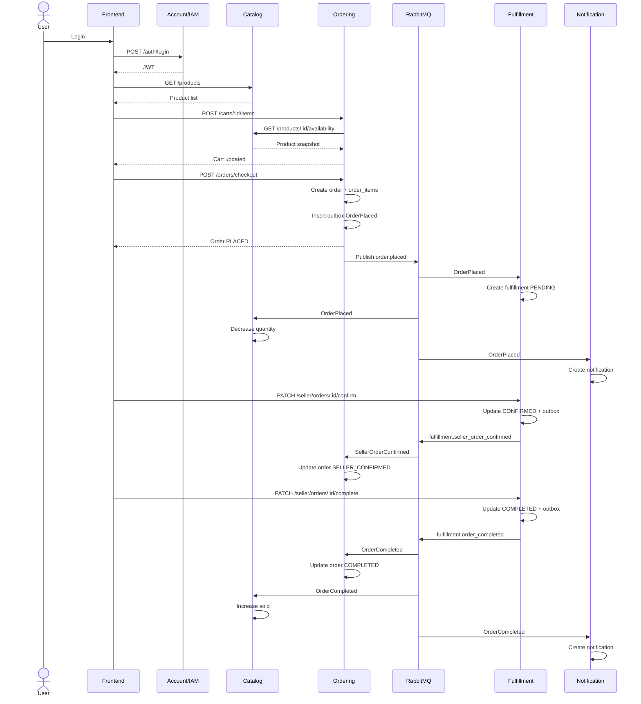

# 9. Thiết kế theo 9 luồng nghiệp vụ cơ bản

## Rank 1. Auth cơ bản: login, JWT, role user/seller/admin

Service chính:

```text
Account / IAM
```

### Dữ liệu sở hữu

```text
users
roles
seller profile nếu có
```

### REST API cần có

```text
POST /auth/login
GET /auth/me
POST /auth/register nếu cần
```

### Event

MVP không cần event.

Optional:

```text
UserRegistered
SellerRegistered
```

### Trạng thái nghiệp vụ

User role:

```text
USER
SELLER
ADMIN
```

User status nếu có:

```text
ACTIVE
DISABLED
```

### Contract cần thống nhất

JWT payload:

```json
{
  "sub": "user-id",
  "role": "USER",
  "sellerId": null
}
```

Sau khi verify token, các service phải lấy được:

```text
userId
role
sellerId
```

### Checklist hoàn thành

```text
Login trả JWT
JWT verify được ở Gateway hoặc từng service
Role guard chạy được
Các API nghiệp vụ lấy được req.user.userId
```

---

## Rank 2. Catalog browse: xem danh sách sản phẩm, chi tiết sản phẩm

Service chính:

```text
Catalog
```

### Dữ liệu sở hữu

```text
catalog
products
```

Catalog có `catalog` để phân loại sản phẩm; `products` lưu thông tin sản phẩm, giá, mô tả, quantity, sold, shopId, images, ranking, StarCount, totalComments, totalRates.

### REST API cần có

```text
GET /products
GET /products/:id
GET /catalogs
GET /products/:id/availability
```

### Event

Không bắt buộc publish event cho browse.

### Trạng thái nghiệp vụ

Product nên có logical status dù schema chưa có:

```text
ACTIVE
OUT_OF_STOCK
HIDDEN
DELETED
```

Nếu chưa có cột status, MVP dùng rule:

```text
quantity > 0  -> available = true
quantity <= 0 -> available = false
```

### Contract cần thống nhất

Ordering sẽ cần Catalog trả:

```json
{
  "productId": "product-id",
  "sellerId": "seller-id",
  "name": "Product A",
  "price": 100000,
  "quantity": 10,
  "available": true
}
```

### Checklist hoàn thành

```text
Frontend xem được list product
Frontend xem được detail product
Ordering gọi được availability endpoint
```

---

## Rank 3. Cart / order draft: tạo giỏ, thêm/sửa/xóa item

Service chính:

```text
Ordering
```

### Dữ liệu sở hữu

```text
ordering.carts
ordering.cart_items
```

Schema Ordering có `carts` với `user_id`, `currency`, `status`, `totals`, `checked_out_at`, và `cart_items` với `cart_id`, `product_id`, `seller_id`, `name`, `quantity`, `unit_price`.

### REST API cần có

```text
POST /carts
GET /carts/active
POST /carts/:cartId/items
PATCH /carts/:cartId/items/:productId
DELETE /carts/:cartId/items/:productId
```

### Service-to-service REST

Ordering gọi Catalog:

```text
GET /products/:id/availability
```

### Event

Không cần event cho MVP.

### Trạng thái nghiệp vụ

Cart:

```text
ACTIVE
CHECKED_OUT
```

### Contract cần thống nhất

Khi add item, Ordering lưu snapshot:

```text
product_id
seller_id
name
quantity
unit_price
```

Không phụ thuộc vào việc Catalog đổi tên hoặc đổi giá sau đó.

### Checklist hoàn thành

```text
User tạo được cart
Thêm item vào cart
Sửa số lượng
Xóa item
Cart tính được totals
```

---

## Rank 4. Checkout / Place Order

Service chính:

```text
Ordering
```

### Dữ liệu sở hữu

```text
ordering.orders
ordering.order_items
ordering.outbox_events
```

Schema Ordering có `orders` với `user_id`, `cart_id`, `status`, `shipping_address`, `payment_method`, `currency`, `totals`, `history`, `cancelled_at`; `order_items` có `order_id`, `product_id`, `seller_id`, `name`, `quantity`, `unit_price`, `line_total`.

### REST API cần có

```text
POST /orders/checkout
GET /orders/:id
GET /orders
```

### Event phát ra

```text
OrderPlaced
```

Routing key:

```text
order.placed
```

### Transaction boundary

```text
BEGIN
  validate cart ACTIVE
  validate cart_items not empty
  create orders status PLACED
  create order_items
  update cart status CHECKED_OUT
  insert outbox_events OrderPlaced
COMMIT
```

### Trạng thái nghiệp vụ

Order khởi tạo:

```text
PLACED
```

### Idempotency

Với checkout, nên hỗ trợ idempotency key từ frontend:

```http
Idempotency-Key: uuid
```

MVP có thể bỏ qua, nhưng production nên có để tránh user bấm checkout nhiều lần.

### Checklist hoàn thành

```text
Checkout tạo được order
Cart chuyển CHECKED_OUT
Order items được snapshot
Outbox có OrderPlaced PENDING
Outbox publisher publish được event
```

---

## Rank 5. Fulfillment consume `OrderPlaced` và tạo `seller_orders`

Service chính:

```text
Fulfillment
```

### Dữ liệu sở hữu

Schema hiện tại:

```text
fulfillments
processed_messages
outbox
```

Bảng `fulfillments` có `orderId`, `customerId`, `sellerId`, `status`, `trackingCode`, `carrier`, các timestamp giao hàng; `processed_messages` dùng để chống consume trùng; `outbox` dùng để phát event trạng thái Fulfillment.

### Event consume

```text
OrderPlaced
```

Queue:

```text
fulfillment.order_placed.q
```

Routing key bind:

```text
order.placed
```

### Logic xử lý

```text
Nhận OrderPlaced
Check processed_messages bằng eventId
Group items theo sellerId
Tạo fulfillment cho từng seller
Insert processed_messages
Ack message
```

### Mapping logical

```text
seller_orders = fulfillments
```

Nếu một order có nhiều seller:

```text
1 order -> nhiều fulfillment records theo sellerId
```

### Trạng thái nghiệp vụ

Fulfillment ban đầu:

```text
PENDING
```

### Event optional phát ra

```text
SellerOrderCreated
```

MVP có thể chưa cần.

### Checklist hoàn thành

```text
Fulfillment queue nhận được OrderPlaced
Không tạo trùng khi event bị gửi lại
Seller nhìn thấy order PENDING
```

---

## Rank 6. Seller cập nhật trạng thái đơn

Service chính:

```text
Fulfillment
```

### Dữ liệu sở hữu

```text
fulfillments
outbox
```

### REST API cần có

```text
PATCH /seller/orders/:id/confirm
PATCH /seller/orders/:id/ship
PATCH /seller/orders/:id/deliver
PATCH /seller/orders/:id/complete
```

### Event phát ra

```text
SellerOrderConfirmed
DeliveryUpdated
OrderCompleted
```

### Routing key

```text
fulfillment.seller_order_confirmed
fulfillment.delivery_updated
fulfillment.order_completed
```

### State transition

```text
PENDING -> CONFIRMED
CONFIRMED -> PACKED
PACKED -> SHIPPED
SHIPPED -> DELIVERED
DELIVERED -> COMPLETED
```

MVP có thể rút gọn:

```text
PENDING -> CONFIRMED -> SHIPPED -> DELIVERED -> COMPLETED
```

### Transaction boundary

Ví dụ confirm:

```text
BEGIN
  check fulfillment belongs to seller
  check status = PENDING
  update status = CONFIRMED
  insert outbox SellerOrderConfirmed
COMMIT
```

### Checklist hoàn thành

```text
Seller confirm được đơn
Seller cập nhật ship/deliver/complete được
Mỗi lần đổi trạng thái có outbox event
Không cho chuyển trạng thái sai
```

---

## Rank 7. Ordering consume event từ Fulfillment để cập nhật order status

Service chính:

```text
Ordering
```

### Dữ liệu sở hữu

```text
orders
inbox_events
```

Ordering có `inbox_events` với `consumer_name`, `event_id`, `processed_at` để chống xử lý trùng.

### Event consume

```text
SellerOrderConfirmed
DeliveryUpdated
OrderCompleted
```

Queue:

```text
ordering.fulfillment_events.q
```

### Mapping event sang order status

|Event|Điều kiện|Order status|
|---|---|---|
|`SellerOrderConfirmed`|fulfillment confirmed|`SELLER_CONFIRMED`|
|`DeliveryUpdated`|status `SHIPPED`|`IN_DELIVERY`|
|`DeliveryUpdated`|status `DELIVERED`|`DELIVERED`|
|`OrderCompleted`|completed|`COMPLETED`|

### Logic xử lý

```text
Nhận event
Check inbox_events
Load order by orderId
Validate transition
Update orders.status
Append orders.history
Insert inbox_events
Ack message
```

### Lưu ý multi-seller

Nếu một order có nhiều seller, không nên set `COMPLETED` khi chỉ một fulfillment completed.

MVP đơn giản:

```text
Một order chỉ có một seller
```

Bản tốt hơn:

```text
Ordering cần lưu hoặc query trạng thái các fulfillment
Order COMPLETED khi tất cả seller fulfillments completed
```

Vì hiện `orders` không có bảng sub-status theo seller, MVP nên giới hạn checkout một seller/order hoặc chấp nhận cập nhật đơn giản.

### Checklist hoàn thành

```text
Ordering nhận được event từ Fulfillment
Order status đổi đúng
Order history có log
Event duplicate không làm update lặp
```

---

## Rank 8. Notification cơ bản khi đặt hàng / hoàn tất đơn

Service chính:

```text
Notification
```

### Dữ liệu sở hữu

```text
notification.notifications
notification.notification_preferences
notification.inbox_events
notification.outbox_events
```

Notification schema có `notifications` gồm `user_id`, `event_name`, `title`, `body`, `channel`, `status`, `payload`, `delivery_attempts`, `created_at`, `sent_at`, `read_at`; có `notification_preferences`; có `inbox_events` và `outbox_events`.

### Event consume

```text
OrderPlaced
SellerOrderConfirmed
DeliveryUpdated
OrderCompleted
```

Queue:

```text
notification.domain_events.q
```

### Template notification

|Event|Người nhận|Title|
|---|---|---|
|`OrderPlaced`|customerId|`Đặt hàng thành công`|
|`SellerOrderConfirmed`|customerId|`Shop đã xác nhận đơn hàng`|
|`DeliveryUpdated`|customerId|`Đơn hàng đang được vận chuyển`|
|`OrderCompleted`|customerId|`Đơn hàng đã hoàn tất`|

### Logic xử lý

```text
Nhận event
Check inbox_events
Build notification từ template
Insert notifications status = PENDING hoặc SENT
Insert inbox_events
Ack message
```

Với in-app notification, có thể set ngay:

```text
status = SENT
sent_at = now
```

### REST API cần có

```text
GET /notifications
PATCH /notifications/:id/read
```

### Checklist hoàn thành

```text
OrderPlaced tạo notification
OrderCompleted tạo notification
Không tạo trùng notification khi consume lại event
Frontend đọc được notification list
Frontend mark read được
```

---

## Rank 9. Catalog projection từ Fulfillment: cập nhật sold/stock

Service chính:

```text
Catalog
```

### Dữ liệu sở hữu

```text
products.quantity
products.sold
products.ranking
```

Catalog tài liệu mô tả `quantity` và `sold` dùng cho quản lý tồn kho / bán hàng; khi đơn thành công thì giảm `quantity`, tăng `sold`.

### Event consume

MVP đề xuất:

```text
OrderPlaced       -> giảm quantity
OrderCompleted    -> tăng sold
OrderCancelled    -> hoàn quantity nếu sau này có cancel
```

Vì rank hiện tại chưa có cancel, trước mắt cần:

```text
OrderPlaced
OrderCompleted
```

Queue:

```text
catalog.order_events.q
```

### Logic xử lý `OrderPlaced`

```text
Nhận OrderPlaced
Check inbox/projection processed event
For each item:
  check product quantity >= item.quantity
  quantity = quantity - item.quantity
Insert processed event
```

### Logic xử lý `OrderCompleted`

```text
Nhận OrderCompleted
For each item:
  sold = sold + item.quantity
Recalculate ranking nếu cần
Insert processed event
```

### Vấn đề cần thống nhất

Có 2 cách xử lý tồn kho:

**Cách A — đơn giản cho MVP**

```text
OrderPlaced -> giảm quantity
OrderCompleted -> tăng sold
```

Ưu điểm: dễ làm.

Nhược điểm: nếu checkout thành công nhưng Catalog consume lỗi tạm thời thì tồn kho update chậm.

**Cách B — chuẩn hơn**

```text
Checkout gọi Catalog reserve stock bằng REST
Catalog reserve thành công
Ordering mới tạo order
OrderCompleted -> sold tăng
OrderCancelled -> release stock
```

Với hệ thống hiện tại, MVP nên dùng Cách A để hoàn thành event-driven flow trước.

### Checklist hoàn thành

```text
Catalog consume được OrderPlaced
Product quantity giảm
Catalog consume được OrderCompleted
Product sold tăng
Duplicate event không trừ/tăng lặp
```

---

# 10. Sequence flow tổng thể MVP



---

# 11. Checklist triển khai theo service

## Account / IAM

```text
[ ] POST /auth/login
[ ] GET /auth/me
[ ] JWT payload thống nhất: sub, role, sellerId
[ ] Role guard USER / SELLER / ADMIN
[ ] Gateway hoặc từng service verify JWT được
```

## Catalog

```text
[ ] GET /products
[ ] GET /products/:id
[ ] GET /products/:id/availability
[ ] Consumer order.placed
[ ] Consumer fulfillment.order_completed
[ ] Inbox/projection idempotency table nếu chưa có
[ ] Update quantity không bị âm
[ ] Update sold không bị lặp
```

## Ordering

```text
[ ] POST /carts
[ ] POST /carts/:cartId/items
[ ] PATCH /carts/:cartId/items/:productId
[ ] DELETE /carts/:cartId/items/:productId
[ ] POST /orders/checkout
[ ] Insert outbox OrderPlaced trong cùng transaction
[ ] Outbox publisher
[ ] Consumer fulfillment events
[ ] Inbox_events chống duplicate
[ ] Order state transition guard
```

## Fulfillment

```text
[ ] Consumer order.placed
[ ] processed_messages chống duplicate
[ ] Tạo fulfillments PENDING
[ ] GET /seller/orders
[ ] PATCH /seller/orders/:id/confirm
[ ] PATCH /seller/orders/:id/ship
[ ] PATCH /seller/orders/:id/deliver
[ ] PATCH /seller/orders/:id/complete
[ ] Insert outbox SellerOrderConfirmed / DeliveryUpdated / OrderCompleted
[ ] Outbox publisher
```

## Notification

```text
[ ] Consumer order.placed
[ ] Consumer fulfillment.seller_order_confirmed
[ ] Consumer fulfillment.delivery_updated
[ ] Consumer fulfillment.order_completed
[ ] inbox_events chống duplicate
[ ] Notification templates
[ ] GET /notifications
[ ] PATCH /notifications/:id/read
```

---

# 12. Thứ tự triển khai khuyến nghị

Làm theo đúng thứ tự này để giảm lỗi integration:

```text
1. Account/IAM login + JWT guard
2. Catalog browse + product availability
3. Ordering cart APIs
4. Ordering checkout + outbox OrderPlaced
5. RabbitMQ exchange/queue + outbox publisher
6. Fulfillment consume OrderPlaced
7. Fulfillment seller status APIs + outbox events
8. Ordering consume fulfillment events
9. Notification consume events
10. Catalog consume OrderPlaced/OrderCompleted để update stock/sold
```

Khi hoàn thành tới bước 6, hệ thống đã có flow event-driven đầu tiên:

```text
Checkout -> OrderPlaced -> Fulfillment tạo đơn seller
```

Khi hoàn thành tới bước 10, hệ thống có MVP end-to-end:

```text
Login
-> Browse product
-> Add to cart
-> Checkout
-> Fulfillment xử lý
-> Ordering cập nhật trạng thái
-> Notification thông báo
-> Catalog cập nhật quantity/sold
```

---

# 13. Quy tắc “được tự do” và “bắt buộc thống nhất”

## Bắt buộc thống nhất

```text
Event name
Routing key
Payload field name
Payload data type
Order status
Fulfillment status
JWT payload
API endpoint chính
Error response format
Outbox/inbox rule
Queue binding
```

## Được tự triển khai riêng

```text
Cấu trúc module NestJS
Tên class/service/controller
ORM entity nội bộ
Cách lưu history chi tiết
Cách tính ranking
Cron interval của outbox publisher
Cách retry nội bộ
Cách chia service layer
```

Kết luận ngắn gọn:

```text
Contract bên ngoài phải giống nhau.
Implementation bên trong có thể khác nhau.
```